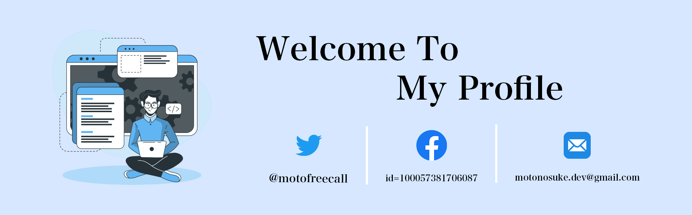

<h1>&nbspHello everyone</h1>

💁‍♂️  My name is Motonosuke Iiyama. 

💻  I work as a front-end engineer.

❤️ I like technologies such as React and Nextjs, and I am most familiar with them in my work.

<h2>📈 my github stats</h2>

